# My Liver Protector

## Product Overview

<!-- 《护肝使者》是一款基于手绘游戏化风格的肝健康管理小程序，融入了一种将医学知识科普、健康生活打卡记录、个性化健康帮助结合的新颖的设计理念，营造了一个培养宠物肝宝宝的卡通世界。 -->
"**The Liver Guardian**" is a liver health management mini-program based on a hand-drawn gamified style. It incorporates a novel design concept that combines medical knowledge dissemination, health lifestyle check-ins, and personalized health assistance. It creates a cartoon world where users can cultivate their own pet liver babies.

<!-- 前端代码在当前仓库的文件夹下，你可以使用微信开发者工具将它运行起来。 -->
You can download the frontend code in the current repository and use the [WeChat Developer Tools](https://developers.weixin.qq.com/miniprogram/en/dev/devtools/download.html) to run it.

<!-- 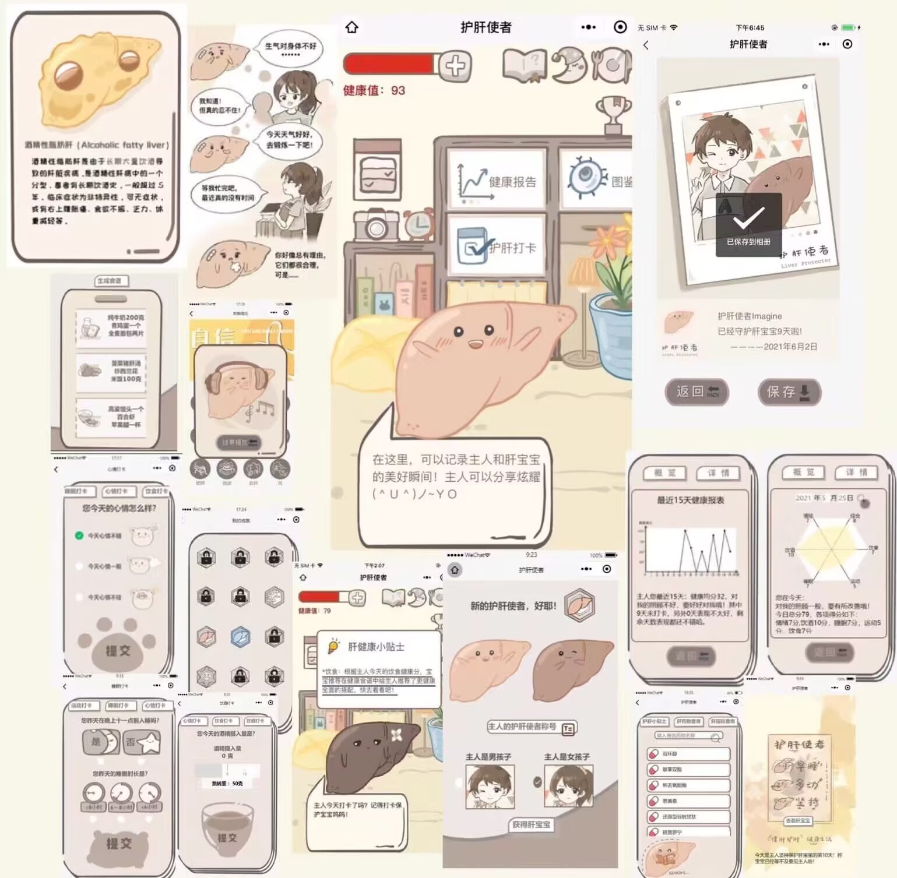 -->

    

## My Liver Pet
<!-- 你在第一次登录时将看到一则漫画，认识肝脏在免疫、消化、解毒中的重要功能，以及不健康行为对肝脏健康的伤害。 -->
During your first login, you will encounter a comic strip that introduces the liver's crucial functions in immunity, digestion, and detoxification, as well as the detrimental effects of unhealthy behaviors on liver health.

<!-- 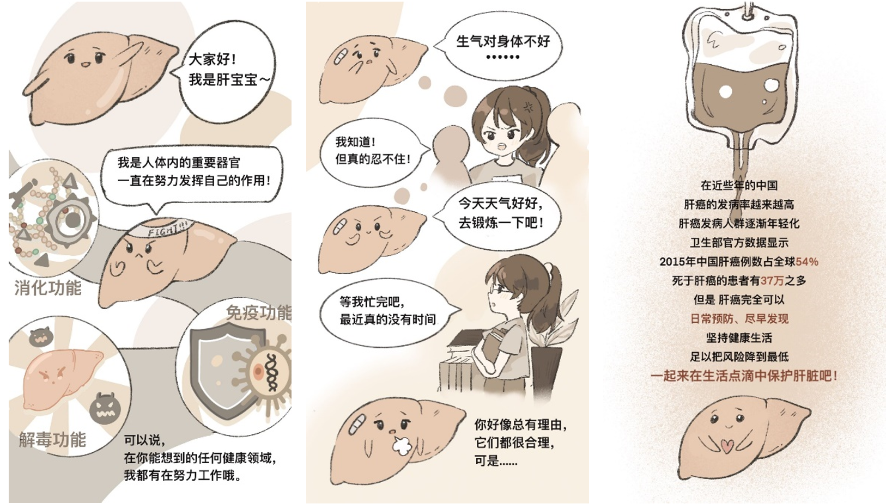 -->

    

<!-- 你填写肝健康情况调查问卷，并获得相应健康值的肝宝宝。你可以记录自己和肝宝宝的每个瞬间。 -->
You will fill out a liver health survey questionnaire and receive a liver baby with corresponding health values. You can record every moment of yourself and your liver baby.

<!-- 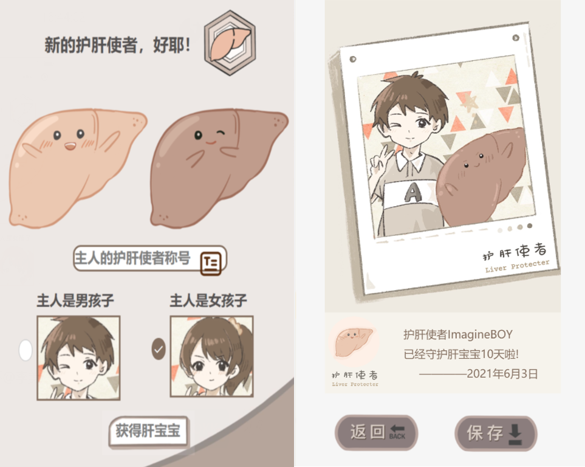 -->

    

<!-- 你需要完成每日任务提升肝宝宝健康分数，培养更健康的肝宝宝。下图分别为三种不同肝健康形态的肝宝宝： -->
You need to complete daily tasks to improve the health score of your liver baby and cultivate a healthier liver baby. The following images depict three different liver baby forms representing various liver health conditions:

<!-- 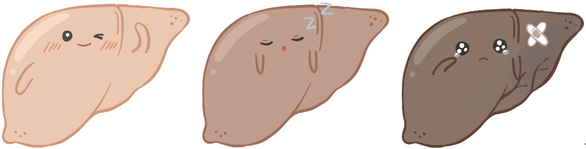 -->
<!-- 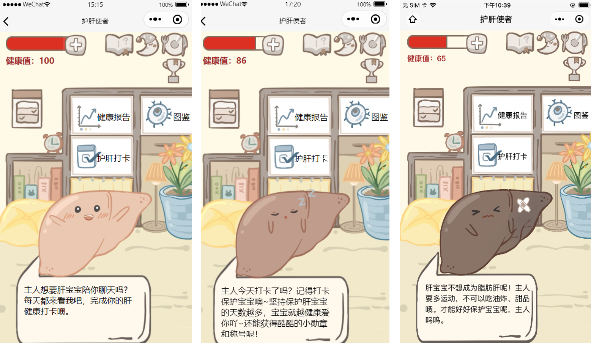 -->

    

<!-- 你可以解锁肝健康成就： -->
You can unlock liver health achievements:

    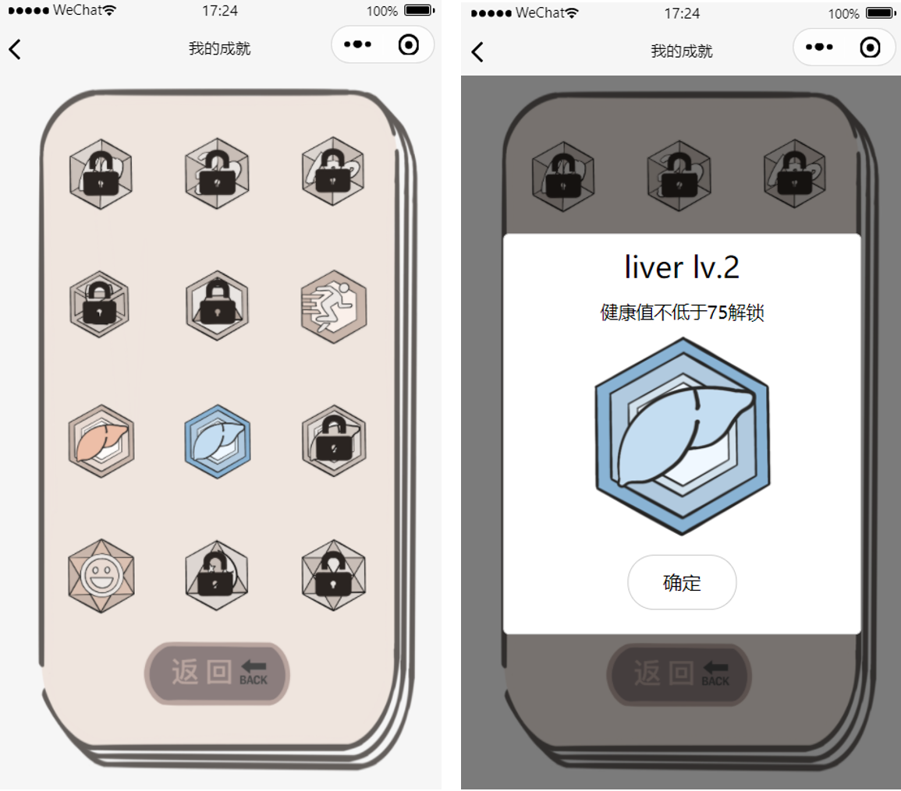

## Health Lifestyle Check-ins

<!-- 你需要完成每日任务保持肝宝宝的健康值，比如达到一定的入睡时间。你可以通过佩戴智能手环或者手动打卡录入这些数据。 -->
You need to complete daily tasks to maintain the health value of your liver baby, such as achieving a certain amount of sleep time. You can track and input these data by wearing a smart bracelet or manually checking in.

<!-- 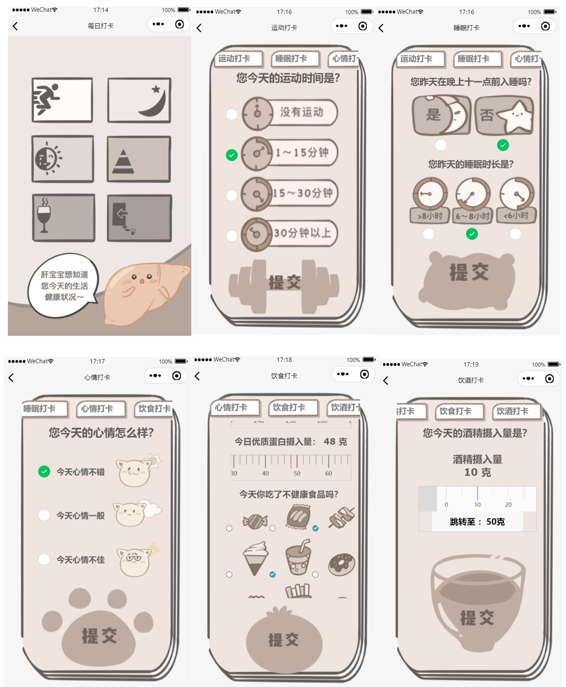 -->

    

<!-- 当你没有完成任务或者系统监测到您当天健康情况较差时，会在主界面提醒你。 -->
When you fail to complete a task or the system detects that your health condition is poor for the day, you will be reminded on the main interface.

<!-- 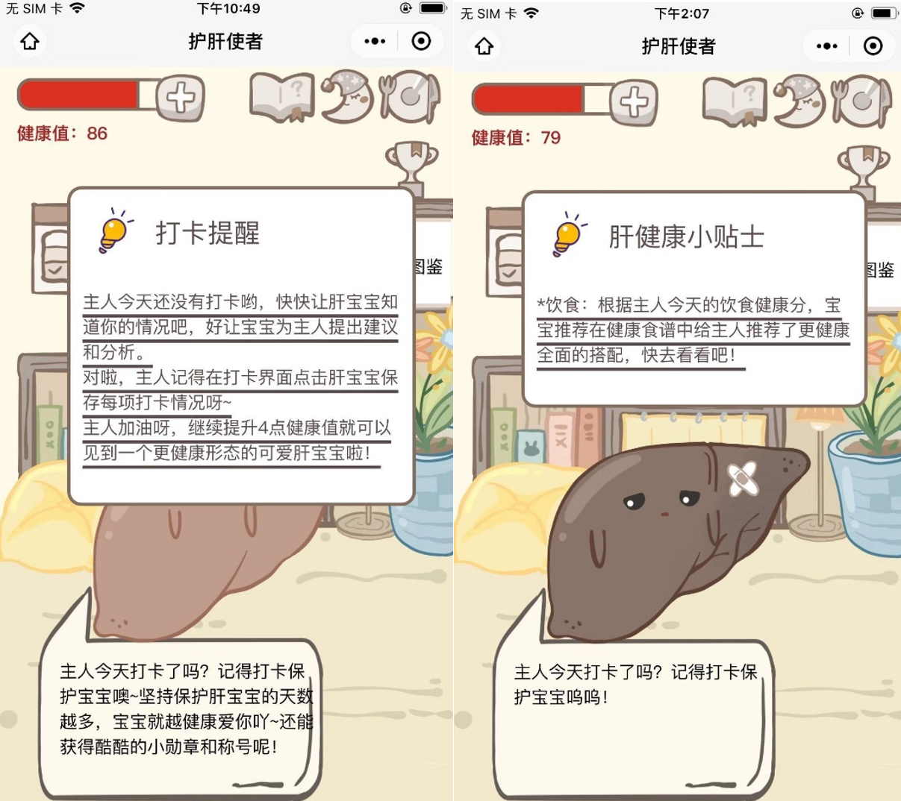 -->

    

## Personalized Health Assistance

### My Music

<!-- 在助眠减压模块，系统会根据你最近的运动和心情数据为你推送合适的音乐，帮助你快速入睡、减小压力。 -->
In the sleep aid and stress relief module, the system will recommend suitable music based on your recent activity and mood data to help you fall asleep quickly and reduce stress.

<!-- 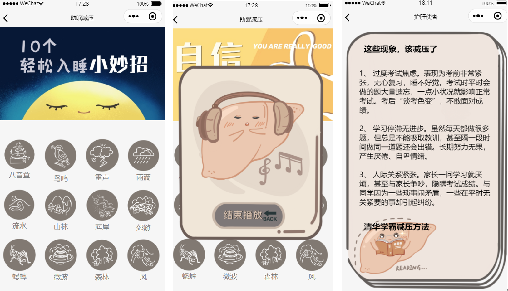 -->

    

### My Diet

<!-- 在食谱模块，系统会根据你最近的心情、体重、睡眠等数据为你推送合适的食谱。 -->
In the recipe module, the system will recommend suitable recipes based on your recent mood, weight, sleep, and other data.

<!-- 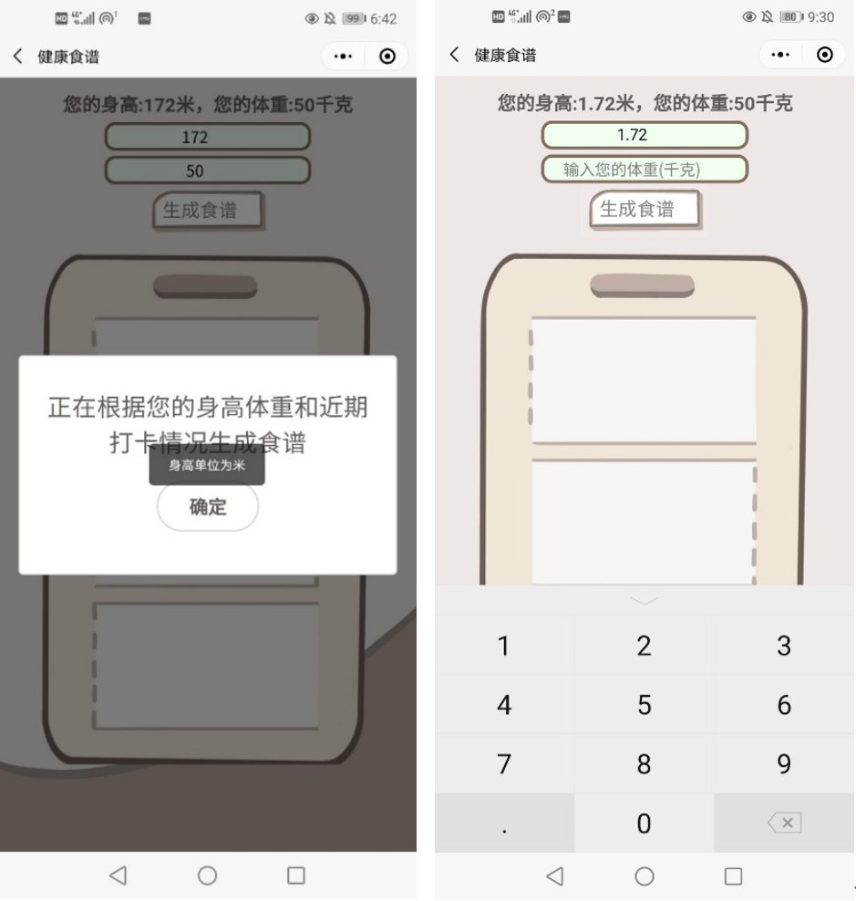 -->

    

### Health Tips

<!-- 在健康指南模块，你可以搜索各种肝药物信息。 -->
In the health guide module, you can search for various liver medication information.

<!-- 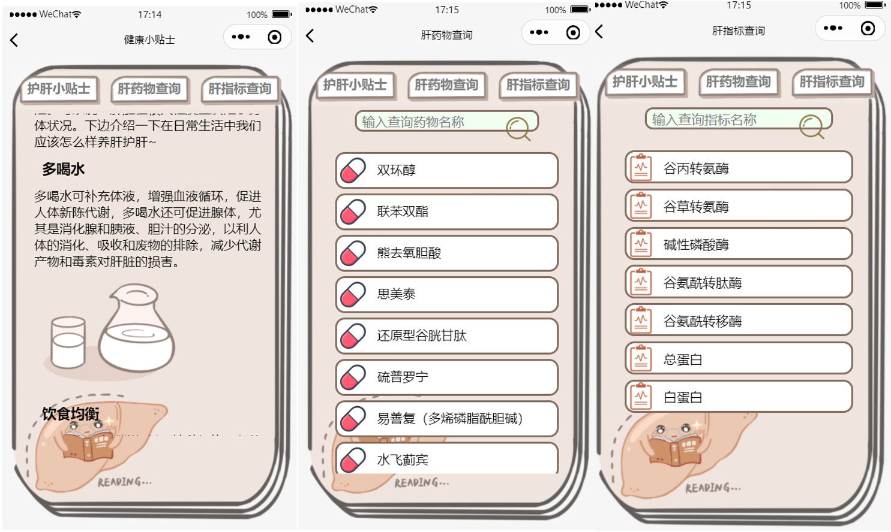 -->

    

<!-- 你可以通过卡通卡片的形式阅读各种肝脏有关的医学科普知识。 -->
You can read various medical popular science knowledge related to the liver in the form of cartoon cards.

<!-- 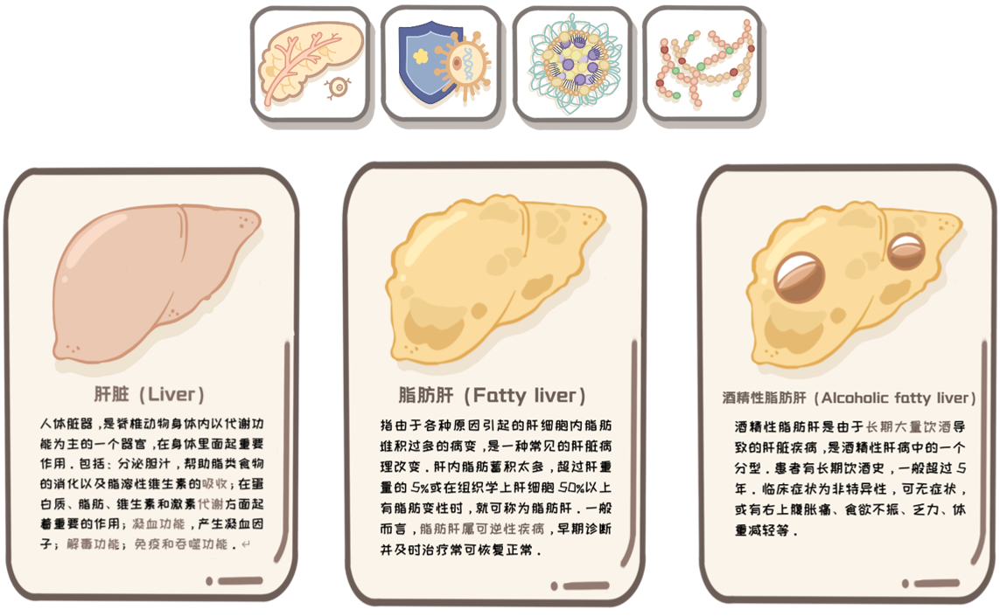 -->

    

